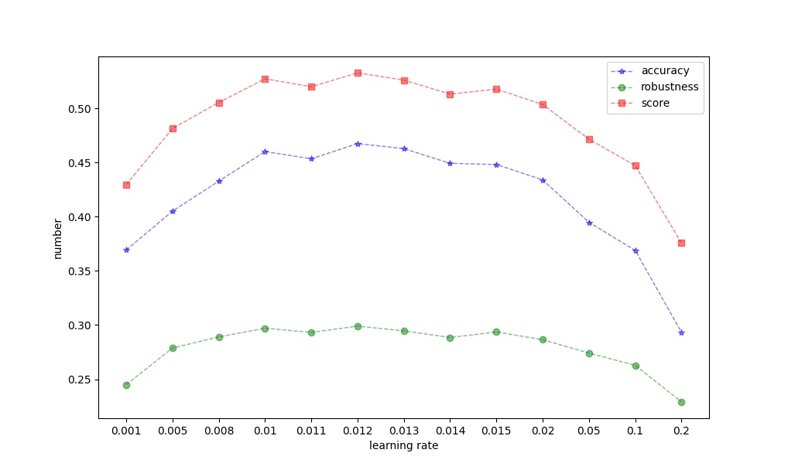

## Homework 2: Adversarial Robustness


### PGD attack

PGD攻击是一种迭代的优化算法，它在每一步都沿着损失函数的梯度方向对输入数据进行微小的调整，以最大化损失函数。

```python
def attack_pgd(model, X, y, epsilon=8/255, alpha=2/255, attack_iters=10, restarts=1, lower_limit=torch.tensor([0]), upper_limit=torch.tensor([1])):
    """
    model: Model to attack.
    X: Input image
    y: Class of input image
    epsilon: Budget of PGD attack
    alpha: Step size for PGD attack
    attack_iters: Iterations for PGD attack
    restarts: Restarts for PGD attack
    lower limits: Lower limits for Input Images
    upper limits: Upper limits for Input Images
    """
    ###################################
    # write the code here

    # 设置最终的达到最大损失的delta为'0'
    max_delta = torch.zeros_like(X)

    # 设置最终的最大损失为 -inf，最小的数
    max_loss = float('-inf')
    
    for _ in range(restarts):
        # 对于每次restarts,随机初始化扰动delta，并将delta限制在(-epsion,epsion)的范围内。设置为需要梯度计算
        delta = torch.rand_like(X, requires_grad=True)
        delta.data = torch.clamp(delta.data, -epsilon, epsilon)
        
        # 迭代过程最大化loss
        for _ in range(attack_iters):

            # 对于得到的新的对抗样本
            output = model(X + delta)
            
            # 计算交叉熵损失
            loss = nn.CrossEntropyLoss()(output, y)

            # 进行反向传播，计算并存储损失对delta的梯度
            loss.backward()
            grad = delta.grad.detach()

            # 根据梯度方向更新扰动delta，并进行限制防止delta和X+delta不会超出相应的范围
            delta.data = torch.clamp(delta + alpha * torch.sign(grad), -epsilon, epsilon)
            delta.data = clamp(delta.data, lower_limit - X, upper_limit - X)
            # 清零delta的梯度
            delta.grad.zero_()
        
        # 找到在所有攻击restarts中产生的最大扰动对应的delta,并返回
        output = model(X + delta)
        total_loss = nn.CrossEntropyLoss()(output, y)
        if total_loss > max_loss:
            max_delta = delta.detach()
            max_loss = total_loss
            
    ###################################
    return max_delta
```


### C&W attack

CW攻击算法的目标是最小化扰动的大小，并使模型在对抗样本上产生错误的分类。

```python
    # 计算C&W攻击的损失函数
    def _f(adv_imgs, labels):
        ###################################
        # write the code here

        # 无目标攻击
        outputs = model(adv_imgs)

        # 计算正确类别的损失，也就是模型对正确类别的置信度
        correct_loss = torch.max(outputs * labels.float(), dim=1)[0]

        # 计算其他类别中的最大置信度
        others_max, _ = torch.max(outputs * (1 - labels.float()), dim=1)

        # 根据C&W攻击的损失函数计算损失，包括对抗损失项和对抗性常数项
        loss = torch.clamp(others_max - correct_loss + cw_c, min=0)

        # 返回损失的平均值作为最后的损失值
        return torch.mean(loss)
        ###################################
        # return loss
```

```python
for _ in tqdm.tqdm(range(binary_search_steps)):
        delta = torch.zeros_like(X)
        delta.detach_()
        delta.requires_grad = True
        optimizer = torch.optim.Adam([delta], lr=cw_lr)
        prev_loss = 1e6
        for step in range(cw_iters):
            optimizer.zero_grad()
            adv_examples = scaler(x_arctanh + delta)
            ###################################
            # write the code here

            # 计算对抗样本的损失，调用之前定义的'_f'函数
            loss = _f(adv_examples, y)

            # 反向传播，计算损失函数对扰动delta的梯度
            loss.backward()

            # 更新扰动delta
            optimizer.step()
            ###################################
            if step % (cw_iters // 10) == 0:
                if loss > prev_loss:
                    break
                prev_loss = loss
        adv_imgs = scaler(x_arctanh + delta).detach()
    return adv_imgs
```

### Tricks for AT

这部分我通过change hyperparameter来提升模型的准确度和鲁棒性。
我所修改的参数为learning rate

我通过执行 python .\homework_defense.py --lr mlr --seed 1

其中 mlr 为我所设置的learning rate,初始值为 0.1

我通过调整mlr并执行得到下图



从中可以得出当 learning rate 为 0.012时，表现最好
此时natural_accuracy=0.4674,robustness=0.2990,score=0.5327


因此当**learning rate 为 0.012**时, **score 取得最大值 0.5327**

为保存随机种子，添加以下代码

```python
import numpy as np 
import random

torch.manual_seed(args.seed)
torch.cuda.manual_seed_all(args.seed)
torch.backends.cudnn.deterministic = True
torch.backends.cudnn.benchmark = False
random.seed(args.seed)
np.random.seed(args.seed)
```